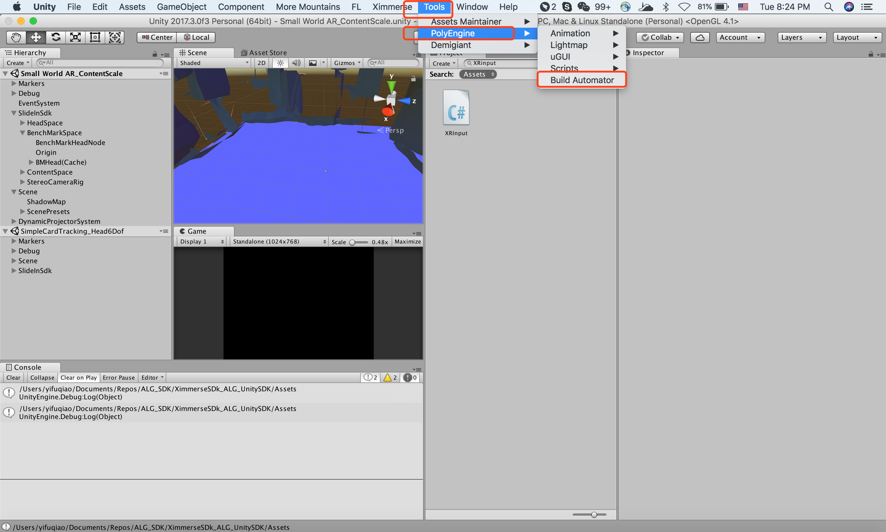
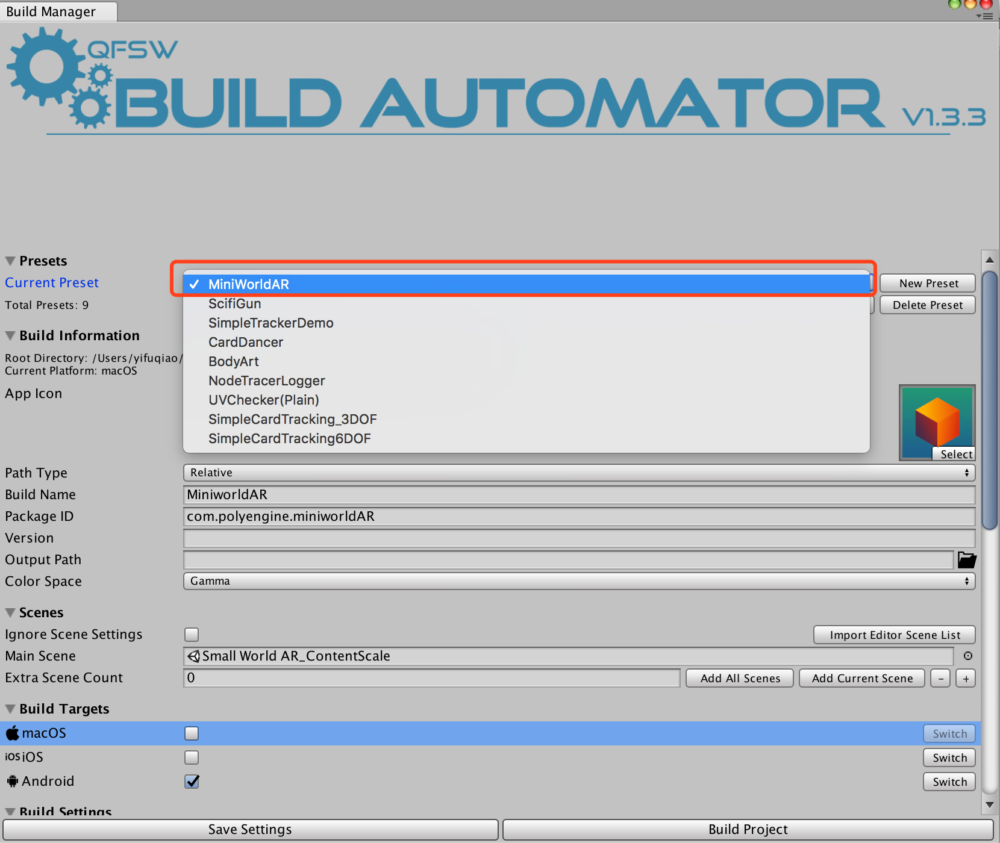
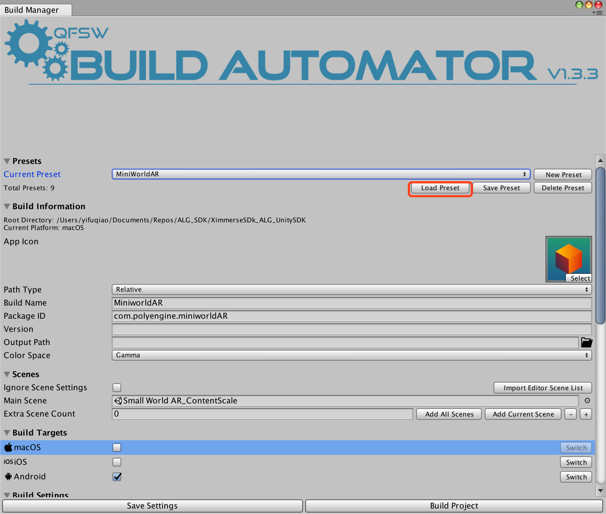
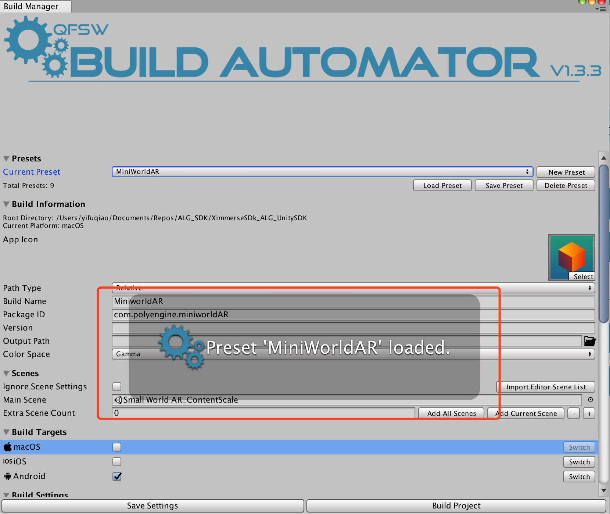
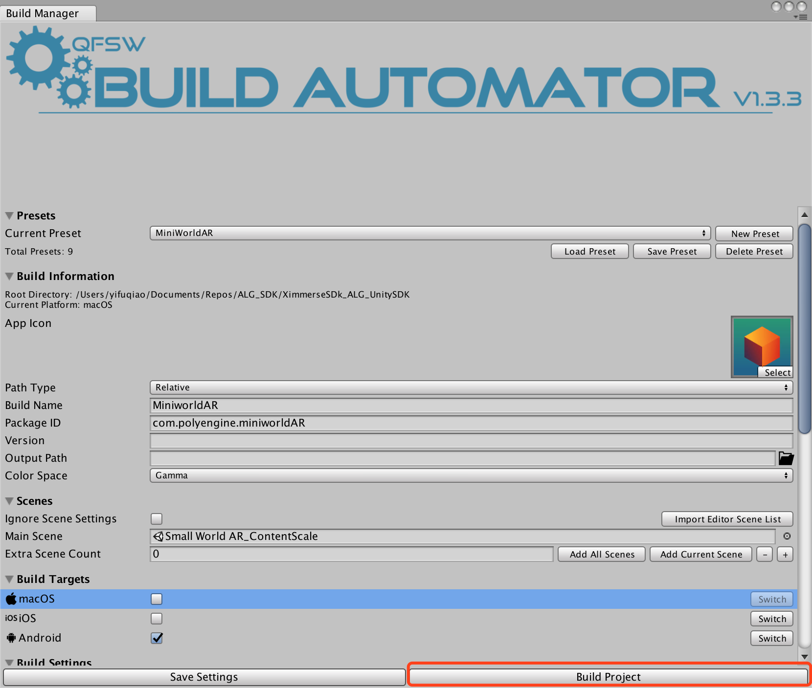

# Introduction
Thanks for using Ximmerse Slide-in AR Headset. Ximmerse Slide-in AR Headset is designed with IR tracking technologies. The headset communicates with the phone with a USB cable. IR tracking marker can be used without any electronic; marker itself also provides position data and rotation data. Comibining marker and Ximmerse Flip controller is also possible via provided SDK, creating more complex and accurate interactions. 


# Headset Rendering
Ximmerse Slide-in AR Headset utilizes stereo rendering done on the phone, similar to the techniques used in VR, to create AR experience. The images rendered on the phone are reflected onto see through lenses, and the reflected images are what human eyes see. To combat image distortion created by lenses, Unity renders images on a distorted mesh, making the final images appear to human eyes un-distorted.

# Development Environment
## Unity Versions
2017.3.0f1

Other Unity versions may work, but they haven't been tested extensively by us. Please report any issue you may find to us. 

## Deployment Platforms
Android 6.0 or above.

## Development Platforms
Mac OS X is supported.
Windows 10 should work, but it hasn't been tested extensively. Please report any issue you find on Windows 10.

# Tutorials
## How to Run SDK Demo
SDK comes with a few demos for developers to use as refferences. The following steps show how to create a demo APK. This tutorial uses MiniWorldAR Demo scene as an example, but other demos follows identical steps.

1. Open Build Automator as shown below：


2. Change Current Preset to your desired demo. This tutorial uses miniworld as an example：


3. Select Load Preset：


4. A pop up dialog should show up to indictate settings are loaded：


5. Hit Build button to create APK：


6. Install APK to Android phone.


# Video Tutorial 
## Hello World: Marker Tracking
[](http://v.youku.com/v_show/id_XMzU2OTM2ODkzMg==.html?spm=a2h3j.8428770.3416059.1)

## How to Config SlideInSDK Prefab
[](https://youtu.be/iReTtQUGo54)
 

# API Documentation

## XCobraInput
XCobraInput is a wapper for ControllerInput. Currently, XCobraInput only supports one controller(,which is left controller or the "XCobra-0" controller).

### XCobraInput.Initialize()
Type | Function
--------- | ------- 
void | Initialize SDK and hardware.

### XCobraInput.HeadDeltaRotationAngle
Type | Function
--------- | ------- 
float | Get delta head rotation(compared to last frame).

### XCobraInput.HasControllerTriggerInput（）
Type | Function
--------- | ------- 
bool | Determine if trigger button is pressed.

### XCobraInput.HasControllerRecenterInput（）
Type | Function
--------- | ------- 
bool | Determine if recenter button is pressed.

### XCobraInput.RecenterController(float yaw)（）
Type | Function
--------- | ------- 
void | Recenter the orientation of the controller. Use value 0.0f to set controller heading to headset heading.

### XCobraInput.GetControllerRotation（）
Type | Function
--------- | ------- 
Quaternion | Get Rotation data from controller. This data is handled by SDK and can be applied to secene objects directly.

### XCobraInput.GetControllerRawRotation（）
Type | Function
--------- | ------- 
Quaternion | Get raw rotation data.

### XCobraInput.Viberate(int strength, float time)
Type | Function
--------- | ------- 
void | Vibrate the controller. The strength range is 0-100.

### XCobraInput.IsControllerButtonDown(XimmerseButton btn)
Type | Function
--------- | ------- 
bool | Determine if a Ximmerse button is pressed (compared to last frame).

### XCobraInput.IsControllerButtonUp(XimmerseButton btn)
Type | Function
--------- | ------- 
bool | determine if a Ximmerse button is released (compared to last frame).

### XCobraInput.IsControllerButtonPressed(XimmerseButton btn)
Type | Function
--------- | ------- 
bool | Determine if a Ximmerse button is being hold down at the moment.

### XCobraInput.GetTouchPadPosition（）
Type | Function
--------- | ------- 
Vector2 | Provide finger position on touch pad.

## XDevicePlugin
```csharp
using System.Collections;
using UnityEngine;
using Ximmerse.InputSystem;

public class Sample : MonoBehaviour {

    ControllerInput m_controllerInput;

	// Use this for initialization
    IEnumerator Start() 
    {
        XDevicePlugin.Init();
        XDevicePlugin.StartBLEScan();
        m_controllerInput = new ControllerInput("XCobra-0");

        while(m_controllerInput.connectionState!= DeviceConnectionState.Connected)
        {
            yield return null;
        }

        Debug.Log("Controller is connected!!");
        XDevicePlugin.StopBLEScan();
	}
	
	// Update is called once per frame
	void Update () 
    {
        if(m_controllerInput.connectionState == DeviceConnectionState.Connected)
        {
            Debug.Log("Battery Level = " + m_controllerInput.batteryLevel);
            if (m_controllerInput.GetButtonDown(XimmerseButton.Trigger))
            {
                Debug.Log("trigger hit!");
            }
        }
	}

	private void OnApplicationPause(bool pause)
	{
        if (pause)
            XDevicePlugin.OnPause();
        else
            XDevicePlugin.OnResume();
	}

	private void OnApplicationQuit()
	{
        XDevicePlugin.Exit();
	}
}
```

> This sample provids basic usage of XDevicePlugin. Please pay attention to all the details in the code.
 

This class acts as a bridge between Unity and Native libs, and it contains a lot of static functions.
### XDevicePlugin.Init()
Type | Function
--------- | ------- 
int | When returning value is equal or larger than 0, it means the function is executed successfully. Init must be called before calling any other function in the SDK or the program won't function properly. 

### XDevicePlugin.Exit()
Type | Function
--------- | ------- 
int | When returning value is equal or larger than 0, it means the function is executed successfully. This function shuts down SDK and disconnects all the devices.

### XDevicePlugin.onPause()
Type | Function
--------- | ------- 
void | Must be called upon backgrounding the application.

### XDevicePlugin.onResume()
Type | Function
--------- | ------- 
void | Must be call when resuming the application.

### XDevicePlugin.GetInputDeviceHandle(string name)
Type | Function
--------- | ------- 
int | Get Device handle with a device. Supported values are "XCobra-0", "XCobra-1".

### XDevicePlugin.GetInputDeviceName(int which)
Type | Function
--------- | ------- 
string | Get device name with a handle.

### XDevicePlugin.SetMaxBleConnection(int num)
Type | Function
--------- | ------- 
void | Set max number of controllers that can be connected. 2 is the maximum number; by default, max number of controllers is 1.

### XDevicePlugin.GetMaxBleConnection()
Type | Function
--------- | ------- 
int | Get current max number of controllers.

### XDevicePlugin.StartBLEScan()
Type | Function
--------- | ------- 
void | Start bluetooth scanning function on the phone. During scaning mode, users must press both button on right below touch pad to have the controller paired.

### XDevicePlugin.StopBLEScan()
Type | Function
--------- | ------- 
void | When controller is paired, it is recommended to call this function to have the phone stop scanning.

## ControllerInput
```csharp
using UnityEngine;
using Ximmerse.InputSystem;

public class Sample : MonoBehaviour {

    ControllerInput m_controllerInput;

	// Use this for initialization
	void Start () {
        XDevicePlugin.Init();
        m_controllerInput = new ControllerInput("XCobra-0");
	}
	
	// Update is called once per frame
	void Update () {
        Debug.Log("Battery Level = " + m_controllerInput.batteryLevel);
        if(m_controllerInput.GetButtonDown(XimmerseButton.Trigger))
        {
            Debug.Log("trigger hit!");
        }
	}
}

```
> The constructor shown in the sample code is recommended constructor. "XCobra-0" stands for "Left" controller. Similarly, "XCobra-1" stands for "Right" controller. The controllers don't have be left or right controllers. The left and right concepts are used here to descible the usage easily. 


This class represents real physical controller. Controller connection status, rotation or button states can all be accessed from this class. 

### ControllerInput.type 
Type | Function
--------- | ------- 
ControllerType | ControllerInput type. 

### ControllerInput.handle 
Type | Function
--------- | ------- 
int | ControllerInput handle. This handle will be used very frequently by developers.

### ControllerInput.name 
Type | Function
--------- | ------- 
string | ControllerInput name.

### ControllerInput.trackingResult
Type | Function
--------- | ------- 
TrackingResult | Tracking status.

### ControllerInput.positionTracked
Type | Function
--------- | ------- 
bool | Check if controller position is being tracked.

### ControllerInput.rotationTracked
Type | Function
--------- | ------- 
bool | Check if controller orientation is being tracked. 

### ControllerInput.connectionState
Type | Function
--------- | ------- 
DeviceConnectionState | Check controller connection state. 

### ControllerInput.batteryLevel
Type | Function
--------- | ------- 
int | Get battery level. Range is from 0-100.

### ControllerInput.UpdateState（）
Type | Function
--------- | ------- 
void | This function is called by SDK itself. Developers don't have to use this function. This function pulls data from native libs.

### ControllerInput.TouchpadToDpad（）
Type | Function
--------- | ------- 
void | This function converts touch pad data to DPad data, while perserving the original touch pad data. After calling this function, developers can have access to DPad data.

### ControllerInput.TouchpadToSwipe（）
Type | Function
--------- | ------- 
void | This function converts touch pad data to Swipe actions, while perserving the original touch pad data. After calling this function, developers can have access to swipe action data.

### ControllerInput.GetAxis（int axisIndex）
Type | Function
--------- | ------- 
float | Get touch pad data and trigger data. When axisIndex=0，it returns touch pad X axis value.When axisIndex=1，it returns touch pad Y axis value. When axisIndex=2, it returns trigger value. The value is either 0 or 1.

### ControllerInput.GetButton（uint buttonMask）
Type | Function
--------- | ------- 
float | Determine button state on controller. Please use `XimmerseButton` button mask.

### ControllerInput.GetButtonDown（uint buttonMask）
Type | Function
--------- | ------- 
float | Determine if button was pressed compared to last frame. Please use `XimmerseButton` button mask.

### ControllerInput.GetButtonUp（uint buttonMask）
Type | Function
--------- | ------- 
float | Determine if button was released compared to last frame. Please use `XimmerseButton` button mask.

### ControllerInput.GetPosition（）
Type | Function
--------- | ------- 
Vector3 | Get current position of controller relative to headset. This is raw data and can't be used directly.

### ControllerInput.GetRotation（）
Type | Function
--------- | ------- 
Quaternion | Get current rotation of controller relative to headset. This is raw data and can't be used directly.

### ControllerInput.GetAccelerometor（）
Type | Function
--------- | ------- 
Vector3 | Get accelerometor data.

### ControllerInput.GetGyroscope（）
Type | Function
--------- | ------- 
Vector3 | Get gyroscope data. Some controller models may not support this feature, so the SDK would return 0,0,0.

### ControllerInput.GetState（）
Type | Function
--------- | ------- 
XDevicePlugin.ControllerState | Get controller state. This is handled by SDK automatically. Developers don't have to interact with this function.

### ControllerInput.GetPrevState（）
Type | Function
--------- | ------- 
XDevicePlugin.ControllerState | Get controller last frame state. This is handled by SDK automatically. Developers don't have to interact with this function.

### ControllerInput.StartHaptics( int strength, int frequency, float duration = 0.0f ）
Type | Function
--------- | ------- 
void | Vibrate the controller. strength：vibrate strengh, ranging 0-100.frequency：only value 0 is supported at the moment. duration：vibration duration. Please note that some controller models may not support this feature.

